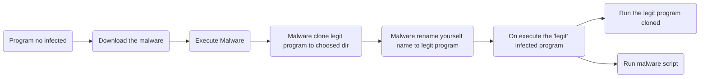

# Simple shapeshifter malware in Python!

**This project  is subject to change!**

I made this project to test my Python skills, i have no responsibility for the use of this program.

Bellow have a fluxgram of malware ideia:

